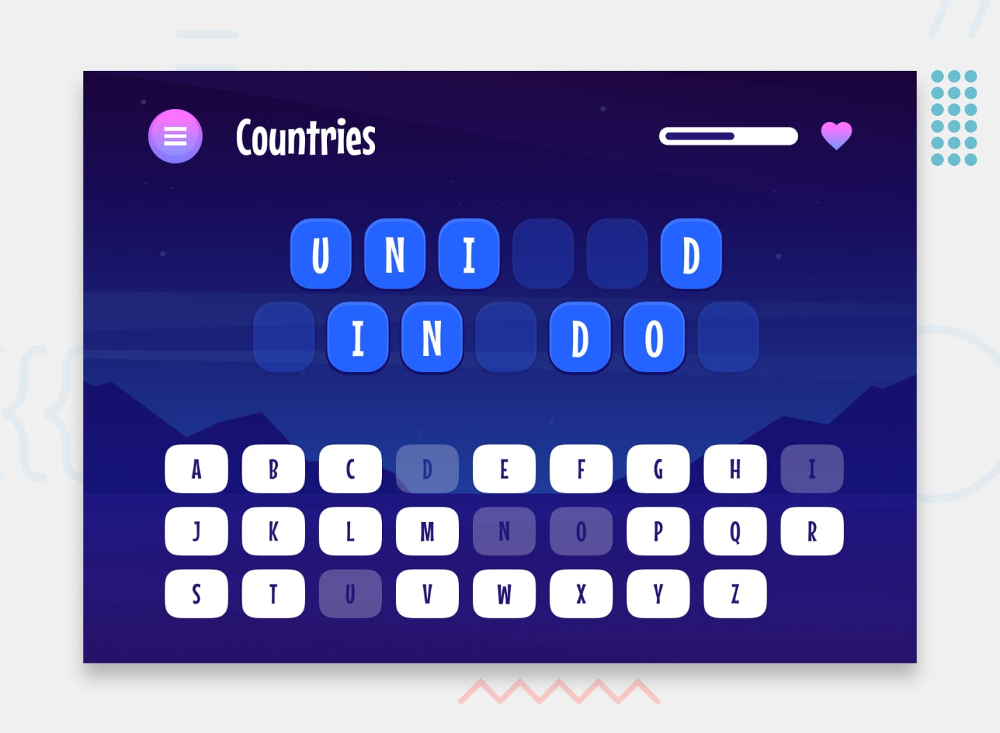

# Frontend Mentor - Hangman game solution

This is a solution to the [Hangman game challenge on Frontend Mentor](https://www.frontendmentor.io/challenges/hangman-game-rsQiSVLGWn). Frontend Mentor challenges help you improve your coding skills by building realistic projects. 

## Table of contents

- [Overview](#overview)
  - [The challenge](#the-challenge)
  - [Expected behavior](#expected-behaviour)
  - [Screenshot](#screenshot)
  - [Links](#links)
- [My process](#my-process)
  - [Built with](#built-with)
  - [What I learned](#what-i-learned)
- [Author](#author)

## Overview

### The challenge

Users should be able to:

- Learn how to play Hangman from the main menu.
- Start a game and choose a category.
- Play Hangman with a random word selected from that category.
- See their current health decrease based on incorrect letter guesses.
- Win the game if they complete the whole word.
- Lose the game if they make eight wrong guesses.
- Pause the game and choose to continue, pick a new category, or quit.
- View the optimal layout for the interface depending on their device's screen size.
- See hover and focus states for all interactive elements on the page.
- Navigate the entire game only using their keyboard.

### Expected behaviour
- You can make the default screen the main menu or the in-game board. Note that we're using the in-game design for the design screenshot, so if you choose the main menu, it won't match up in the design comparison slider. This isn't a big deal, but it is something worth considering. We recommend using the in-game page as the default for solution submission so that the screenshot matches and then switching your code to make the main menu the default screen for new players.
- Pick a random word from the chosen category to start a game. You'll need to work out the spacing for words and when to break to a new line, as some names/titles are (intentionally) long.
- If the player guesses a letter correctly, fill in all relevant spaces and disable the letter on the keyboard.
- If the player guesses incorrectly, disable the letter on the keyboard and reduce the health meter. The health meter should empty after eight wrong guesses. The player loses at this point, and the menu appears.
- Selecting "play again" on the menu starts a new game with the same category. Selecting "new category" navigates to the "pick a category" screen. Quitting navigates back to the main menu.
- Players should never be shown the same name/title multiple times if they play more than one game in a visit. The JSON data has a "selected" boolean to help you filter already played options.
- Clicking the hamburger menu during a game should show the "paused" menu.

### Screenshot

### Links

- Solution URL: [GitHub Repo](https://github.com/mauricevalerio/frontendmentor-challenges/tree/main/hangman-game)
- Live Site URL: [Hangman](https://hangman-fem.vercel.app/)

## My process

### Built with

- HTML
- CSS
- Flexbox
- Grid
- JavaScript
- [Vue](https://vuejs.org/)

### What I learned
Learned Vue Framework Options API by doing this project.

## Author

- Website - [Maurice Valerio](https://www.mauricevalerio.dev/)
- Frontend Mentor - [@mauricevalerio](https://www.frontendmentor.io/profile/mauricevalerio)
