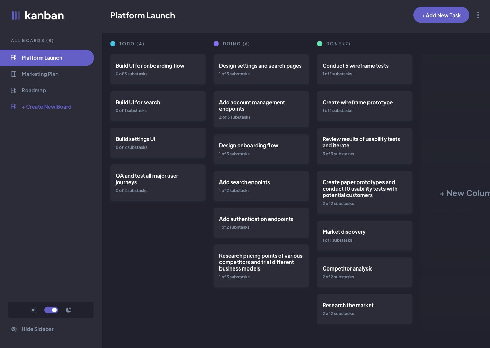

# Frontend Mentor - Kanban task management web app solution

This is a solution to the [Kanban task management web app challenge on Frontend Mentor](https://www.frontendmentor.io/challenges/kanban-task-management-web-app-wgQLt-HlbB). Frontend Mentor challenges help you improve your coding skills by building realistic projects. 

## Table of contents

- [Overview](#overview)
  - [The challenge](#the-challenge)
  - [Screenshot](#screenshot)
  - [Links](#links)
- [My process](#my-process)
  - [Built with](#built-with)
  - [What I learned](#what-i-learned)
  - [Continued development](#continued-development)
- [Author](#author)

## Overview

### The challenge

Your users should be able to:

- [x] View the optimal layout for the app depending on their device's screen size
- [ ] See hover states for all interactive elements on the page
- [x] Create, read, update, and delete boards and tasks
- [x] Receive form validations when trying to create/edit boards and tasks
- [x] Mark subtasks as complete and move tasks between columns
- [x] Hide/show the board sidebar
- [x] Toggle the theme between light/dark modes
- [x] Bonus: Allow users to drag and drop tasks to change their status and re-order them in a column
- [x] Bonus: Keep track of any changes, even after refreshing the browser (localStorage could be used for this if you're not building out a full-stack app)
- [ ] Bonus: Build this project as a full-stack application

### Screenshot

### Links

- Solution URL: [GitHub Repo](https://github.com/mauricevalerio/frontendmentor-challenges/tree/main/kanban-task-management)
- Live Site URL: [Kanban Task Management](https://kanbantaskmgmt.netlify.app/)

## My process

### Built with

- Semantic HTML5 markup
- Flexbox
- Grid
- Mobile-first workflow
- [Tailwind CSS](https://tailwindcss.com/)
- [TypeScript](https://www.typescriptlang.org/)
- [React](https://reactjs.org/)
- [React Bootstrap](https://react-bootstrap.netlify.app/)
- [Redux Toolkit](https://redux-toolkit.js.org/)
- [React Redux](https://react-redux.js.org/)

### What I learned
- Learned the basics of Redux toolkit and use it with React Redux.
- Lesson learned not to use 2 CSS frameworks as the styles conflicts with each other specifically tailwind CSS and React Bootstrap and have to resort to monkey patching it by putting !important when a style needs to be implemented.

### Continued development
Deploy as a full stack web application.

## Author

- Website - [Maurice Valerio](https://mauricevalerio.dev)
- Frontend Mentor - [@mauricevalerio](https://www.frontendmentor.io/profile/mauricevalerio)